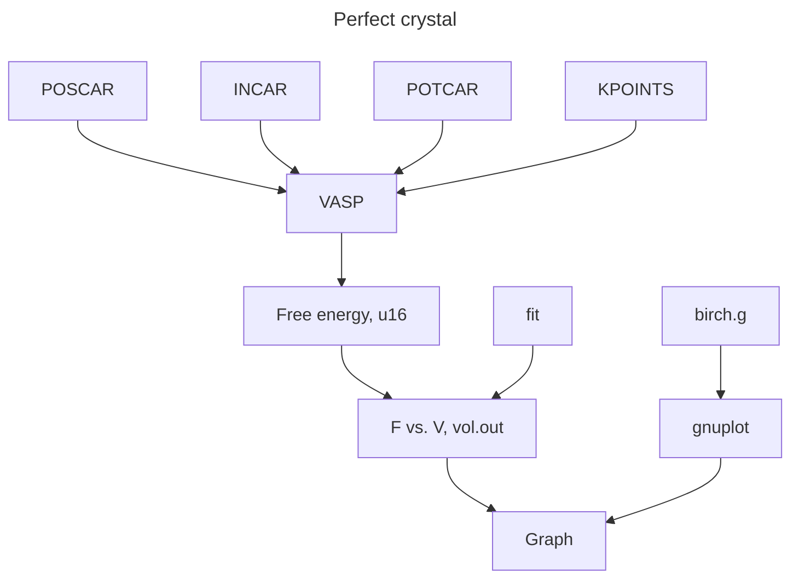
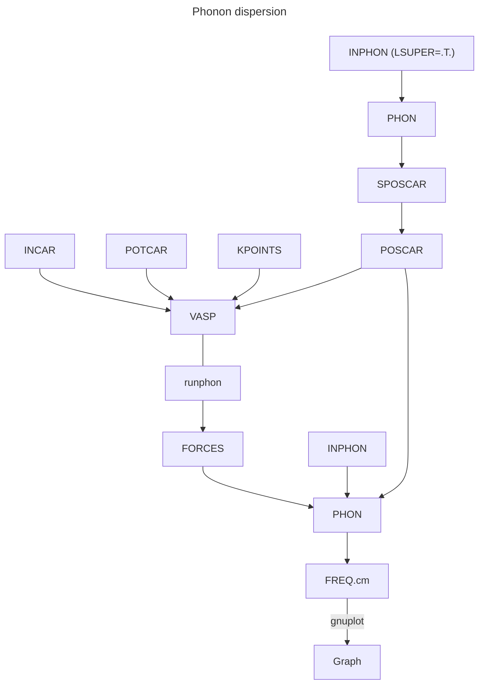
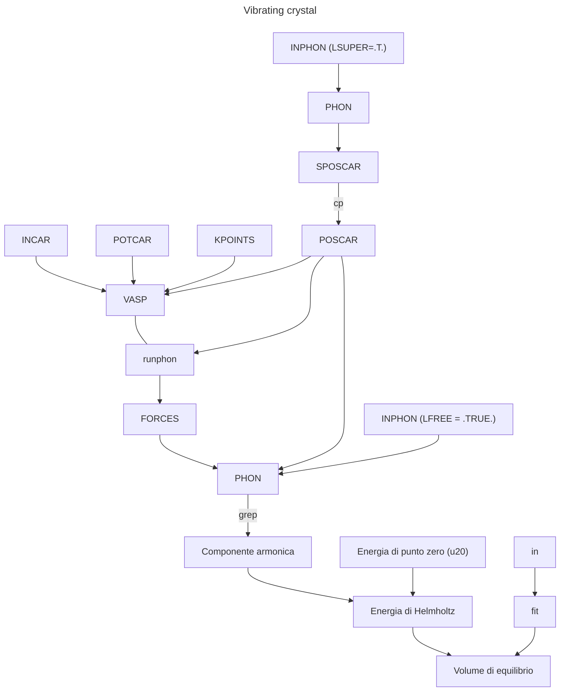
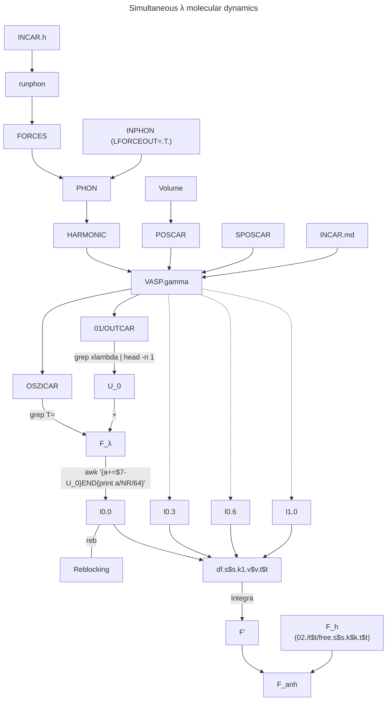

# virtual-matter-lab
## Diagrammi

```mermaid
---
title: Perfect crystal
---
graph TD
POSCAR --> A[VASP]
INCAR --> A
POTCAR --> A
KPOINTS --> A
A --> B[Free energy, u16] --> C[F vs. V, vol.out]
fit --> C
C --> D[Graph]
birch.g --> gnuplot
gnuplot --> D
```

```mermaid
---
title: Phonon dispersion
---
graph TD
INCAR --> VASP --- A[runphon]
POTCAR --> VASP
KPOINTS --> VASP
POSCAR --> VASP
A --> FORCES --> PHON --> FREQ.cm -->|gnuplot| Graph
INPHON --> PHON
POSCAR --> PHON
SPOSCAR --> POSCAR
B[PHON] --> SPOSCAR
C["INPHON (LSUPER=.T.)"] --> B
```

```mermaid
---
title: Vibrating crystal
---
graph TD
INCAR --> VASP --- R[runphon]
POTCAR --> VASP
KPOINTS --> VASP
P[POSCAR] --> VASP
P --> R --> FORCES --> E[PHON] -->|grep| C[Componente armonica] --> A
D["Energia di punto zero (u20)"] --> A[Energia di Helmholtz] --> V[Volume di equilibrio]
in --> fit --> V
F["INPHON (LSUPER=.T.)"] --> G[PHON] --> SPOSCAR -->|cp| P --> E
H["INPHON (LFREE = .TRUE.)"] --> E
```

```mermaid
---
title: Simultaneous λ molecular dynamics
---
graph TD
runphon --> FORCES --> PHON --> HARMONIC --> VASP.gamma
INCAR.h --> runphon
INPHON["INPHON (LFORCEOUT=.T.)"] --> PHON
Volume --> POSCAR --> VASP.gamma
SPOSCAR --> VASP.gamma --> 01/OUTCAR -->|"grep xlambda | head -n 1"| U_0
INCAR.md --> VASP.gamma --> OSZICAR -->|grep T=| F
l0.0 ---|reb| Reblocking
U_0 -->|+| F["F_λ"] -->|"awk '{a+=$7-U_0}END{print a/NR/64}'"| l0.0 --> df
VASP.gamma -.-> l0.3 --> df
VASP.gamma -.-> l0.6 --> df
VASP.gamma -.-> l1.0 --> df[df.s$s.k1.v$v.t$t]
df -->|Integra| F' --> F_anh
F_h["F_h\n(02./t$t/free.s$s.k$k.t$t)"] --> F_anh
```
